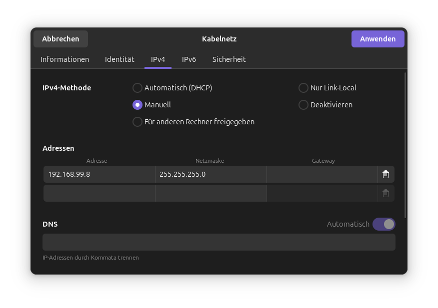

import Tabs from "@theme/Tabs";
import TabItem from "@theme/TabItem";

The school I go to had to replace all the old APs in the school. The head of IT asked two of my friends and me if we wanted to try and find some use-cases for the old APs, because he didn't want to throw them away.

We thought about it and then we came up with the idea to flash OpenWRT on them. It worked! So here is how we did it.

{/* truncate */}

:::note Jump to the guide
This blog post also contains a short summary of the steps we took to flash OpenWRT on the AP 55C.

If you just want to use this as a guide, you can skip the first part and jump to the [Tutorial section](#tutorial).
:::

## The Tech & Concept

The Sophos AP 55C is a wireless access point that runs on a custom firmware which is already based on OpenWRT. The goal was to replace the Sophos firmware with a more open and customizable version - the default version - of OpenWRT.

### Sophos AP 55 vs AP 55C

The Sophos AP 55C is the **C**eiling mountable version of the Sophos AP 55. The main difference is that the AP 55 has a square design with visible antennas, while the AP 55C has a round design and is meant to be mounted on ceilings. Both devices have similar hardware specifications, but the AP 55C is designed for a more discreet installation.

The important thing to note here is that the whilst both devices have a serial console port, the AP 55 has a RJ45 port for the console, while the AP 55C uses UART-Pins inside the device. This means that you need to open the AP 55C to access the console, while the AP 55 can be accessed via a standard RJ45 to Serial cable.

This means you also need different hardware to flash the devices. The AP 55 can be flashed with a standard USB to Serial adapter, while the AP 55C requires a UART adapter. (Or if you want to have another fun project, you can use a Raspberry Pi Pico as a USB-UART-bridge.)

### Concept

The concept is quite simple. You need to connect to the serial console of the AP, interrupt the boot process and then use TFTP to upload the OpenWRT firmware to the device. After that, you can configure OpenWRT as you like.

### Needed Hardware

<Tabs groupId="device">
	<TabItem value="55" label="AP 55">

    	- The Sophos AP 55 itself
      - A USB to Serial RJ45 adapter (I recommend [this one](https://amzn.to/4meEwwE))
      - A computer
      - A PoE switch or injector

  </TabItem>
  <TabItem value="55c" label="AP 55C" default>

    	- The Sophos AP 55C itself
      - Two USB to Serial UART adapters (We used [this one](https://amzn.to/4m8o6ps))
      - A computer
      - A small screwdriver (to open the AP 55C)
      - A PoE switch or injector (We used a [TP-Link TL-PoE160S](https://amzn.to/42chkHW))

  </TabItem>
</Tabs>

## Tutorial

This section will guide you through the steps to flash OpenWRT on the Sophos AP 55C.

As with most Operating System installations, you will start off with a "Live image" of OpenWRT from which you will install the full version of OpenWRT. To provide the live image to the AP, we will use TFTP.

### Step 1: Install a TFTP server

First, you need to install a TFTP server on your computer.

<Tabs groupId="os">
  <TabItem value="windows" label="Windows">

    	I have seen [TFTPD64](https://pjo2.github.io/tftpd64/) used for this. Download and install it. After that, open the program and set the "Current Directory" to the folder where you will store the OpenWRT initramfs-kernel.

  </TabItem>
  <TabItem value="linux" label="Linux (debian-based)" default>

    	On Linux, i recommend you use `tftpd-hpa`. Install it with your package manager. For example, on Debian/Ubuntu, you can use:

      ```bash
      sudo apt-get install tftpd-hpa
      sudo mkdir /srv/tftp
      ```

      The directory `/srv/tftp` will be used as the TFTP root directory in which you will place the OpenWRT initramfs-kernel.

  </TabItem>
</Tabs>

### Step 2: Download the OpenWRT firmware

<Tabs groupId="device">
  <TabItem value="55" label="AP 55">
    Next, you need to download the OpenWRT firmware for the Sophos AP 55. You can find the firmware on the [OpenWRT downloads page](https://downloads.openwrt.org/).

    Please check if the current Stable Release provides a firmware for the Sophos AP 55. If not, you can also use an older Release (At the time of writing this - 24.10.2 is the latest one i found that supports the AP 55).

    You will find the firmware under:

    `ath79 -> generic -> sophos_ap55-initramfs-kernel.bin`

    and

    `ath79 -> generic -> sophos_ap100-initramfs-kernel.bin`

    Download both files and place them in the TFTP root directory you set up in Step 1.

    :::info
    The AP 55 / AP 100 use nearly the same hardware. Therefore the AP 55 sometimes requires the AP 100 firmware to work properly. Just download both firmwares to be sure and the AP will choose the correct one.
    :::

  </TabItem>

  <TabItem value="55c" label="AP 55C" default>

    Next, you need to download the OpenWRT firmware for the Sophos AP 55C. You can find the firmware on the [OpenWRT downloads page](https://downloads.openwrt.org/).

    Please check if the current Stable Release provides a firmware for the Sophos AP 55C. If not, you can also use an older Release (At the time of writing this - 24.10.2 is the latest one i found that supports the AP 55C).

    You will find the firmware under:

    `ath79 -> generic -> sophos_ap55c-initramfs-kernel.bin`

    and

    `ath79 -> generic -> sophos_ap100c-initramfs-kernel.bin`

    Download both files and place them in the TFTP root directory you set up in Step 1.

    Then rename them to `uImage_AP55C` and `uImage_AP100C` respectively. (Without any file extension)

    :::info
    The AP 55C / AP 100C use nearly the same hardware. Therefore the AP 55C sometimes requires the AP 100C firmware to work properly. Just download both firmwares to be sure and the AP will choose the correct one.
    :::

  </TabItem>
</Tabs>

### Step 3: Connect the AP to your TFTP-server

Connect the main RJ45-Port of the AP (PoE-Port) to your computer with an Ethernet cable directly to the computer on which you set up the TFTP server.

Set your computer to the static IPv4-Adress of `192.168.99.8`. The AP will use this to connect to the TFTP server. In the following, you can find instructions for Windows and Ubuntu (with Gnome). For other Operating Systems, please check the documentation of your OS.

<Tabs groupId="os">
  <TabItem value="windows" label="Windows">

    	You can set a static IP address in the Network and Sharing Center. Go to "Change adapter settings", right-click on your Ethernet adapter and select "Properties". Then select "Internet Protocol Version 4 (TCP/IPv4)" and click on "Properties". Here you can set the static IP address.

  </TabItem>
  <TabItem value="linux" label="Ubuntu (Gnome)" default>

      Under Ubuntu I find it easiest to set a static IP address via the GUI. Open the "Settings" application and go to the "Network" section. Here you can select your Ethernet adapter and set a static IP address.

      This will look something like this:

      
  </TabItem>
</Tabs>

### Step 4: Connect to the Serial Console of the AP

<Tabs groupId="device">
  <TabItem value="55" label="AP 55">

    	Connect the USB to Serial RJ45 adapter to your computer and the AP. 

  </TabItem>
  <TabItem value="55c" label="AP 55C" default>

    	First, open the AP 55C with a small screwdriver. You will find the UART pins on the mainboard. The pinout (with the RJ45-Port at the bottom) is as follows from left to right:

      ```
      Pin 1: VCC (3.3V) - Do NOT connect this pin!
      Pin 2: GND
      Pin 3: RX
      Pin 4: TX
      ```

      Connect the Adapters-USB to your computer. Then connect the GND, RX and TX pins of the AP to the corresponding pins of the USB to Serial adapters.
  </TabItem>
</Tabs>

Now, you need to connect to the serial console of the AP. You can use any terminal program for this. I recommend [PuTTY](https://www.putty.org/) for Windows and `minicom` for Linux:

<Tabs groupId="os">
  <TabItem value="windows" label="Windows">

    	Open PuTTY and set the following settings:

      - Connection type: Serial
      - Serial line: COMX (replace X with the number of your COM port)
      - Speed: 115200

      Then click on "Open" to connect to the serial console.

  </TabItem>
  <TabItem value="linux" label="Linux (debian-based)" default>

    	You can use `minicom` and `screen` to connect to the serial console. First, install them if you haven't already:

      ```bash
      sudo apt-get install minicom screen
      ```

      Now, you can connect to the serial console:

      ```bash
      sudo screen /dev/ttyUSB0 115200
      ```
  </TabItem>
</Tabs>

### Step 5: Interrupt the boot process

Now, power on the AP. If it is already powered, you can just unplug and replug the power cable to your PoE switch or injector.

As soon as you see output on the serial console press Enter to interrupt the boot process. You should see a prompt like this:

```bash
ath>
```

If the output of the bootloader is garbage, follow these steps:

<details>
    <summary>Fixing garbage output on the serial console</summary>

    The garbage output is most likely caused by the AP being modified to use 7 data bits instead of the default 8 data bits for TX (**not also on RX**)!

    To fix this you need to reconnect the RX route to the second USB to Serial adapter. Ground needs to be shared between both adapters and the AP.
    Then connect the second adapter to your computer and open a second terminal program (PuTTY or minicom).

    On Putty you can set the data bits in the "Serial" section of the settings. Set it to 7 data bits and connect to the second adapter.

    On minicom we used the following command to start minicom with 7 data bits:

    ```bash
    sudo picocom -b 115200 -d 7 -p n -f n /dev/ttyUSB1
    ```

    On the terminal with which you send commands to the AP, you can now type commands. The other terminal will show the output of the AP.

    The moment the output gets garbage again, switch back to 8 bits by replacing the `-d 7` with `-d 8` in the picocom command or changing it in PuTTY.

</details>

### Step 6: Booting OpenWRT

Now, you can boot OpenWRT from the TFTP server. To do this, type the following command in the serial console:

```bash
tftpboot
setenv fwaddr 0x9f070000
erase $fwaddr +$filesize
cp.b $fileaddr $fwaddr $filesize
iminfo $fwaddr
```

This will prepare the AP with the Image from the TFTP server. If everything works, you should see `Verifying Checksum ... OK` in the output, then you can boot OpenWRT by running the `boot` command.

### Step 7: Installing OpenWRT

After OpenWRT has booted, you should connect the AP to the Internet by plugging the Ethernet cable from the TFTP-Server into your normal network.

The console connection is still active, as it is provided via UART (AP 55C) or a dedicated Console port (AP 55).

Change up the network config of the AP to use DHCP using the text editor `nano`:

```bash
nano /etc/config/network
```

In there replace the following lines:

```diff
config interface 'lan'
    option device 'br-lan'
    // remove-start
    option proto 'static'
    option ipaddr '192.168.1.1'
    option netmask '255.255.255.0'
    // remove-end
    // add-start
    option proto 'dhcp'
    // add-end
    option ip6assign '60'
```

and connect to the Internet using DHCP by running:

```bash
service network restart
ping -c 1 openwrt.com
```

If the response of the ping is successful (0% packet loss), you can now install the full version of OpenWRT by running:

```bash
sysupgrade https://downloads.openwrt.org/releases/24.10.2/targets/ath79/generic/openwrt-24.10.2-ath79-generic-sophos_ap100c-squashfs-sysupgrade.bin
```

:::info
Make sure to replace the URL with the latest version of the OpenWRT firmware - same version as the initramfs-kernel you used to boot OpenWRT.

As with the initramfs-kernel it could be possible that you need to use the AP 100C firmware instead of the AP 55C firmware. You can see this when the installation fails with an error like "upgrade: Device sophos,ap55c not supported by this image".
:::

### Step 8: Finalizing the installation

After the installation is complete, the AP will reboot.

You will need to enable DHCP again on the AP, as the installation will reset the network config.

<details>
    <summary>Enabling DHCP again</summary>

    Change up the network config of the AP to use DHCP using the text editor `nano`:

    ```bash
    nano /etc/config/network
    ```

    In there replace the following lines:

    ```diff
    config interface 'lan'
        option device 'br-lan'
        // remove-start
        option proto 'static'
        option ipaddr '192.168.1.1'
        option netmask '255.255.255.0'
        // remove-end
        // add-start
        option proto 'dhcp'
        // add-end
        option ip6assign '60'
    ```

    and connect to the Internet using DHCP by running:

    ```bash
    service network restart
    ping -c 1 openwrt.com
    ```
    
    If the response of the ping is successful (0% packet loss), you can now continue further.
</details>

Now get the IP address of the AP by running:

```bash
ip a
```

Then set a password for the `root` user by running:

```bash
passwd
```

This will also be the password for the web interface of OpenWRT.

After this you can access the web interface of OpenWRT by opening a web browser and navigating to `http://<IP_ADDRESS_OF_YOUR_AP>`.

Login with the username `root` and the password you set earlier.

You're done! You have successfully installed OpenWRT on your Sophos AP 55 (C) / 100 (C).

## Conclusion

Installing OpenWRT on the AP is not really hard and takes about 15-30 minutes depending on your experience with this kind of stuff.

As the APs are approaching their end of life support from Sophos, masses of them can be found on FB-Marketplace, eBay or (my recommendation for germans) Kleinanzeigen. You can get them for around 20-30€ which is a really good price for a PoE-capable access point with really decent performance. 

I hope you enjoyed this blog post and maybe you will also start running free software on your own devices.

Thanks to my teammates in school for working together on this project and thanks to the head of IT at [my school](https://lls-bad.de) for providing us with the hardware. Also thanks to [this tutorial](https://forum.openwrt.org/t/howto-installing-openwrt-on-sophos-ap-55-and-ap-100) for providing a good starting point and base for this project to build on.

**And at last, thanks for reading this!**